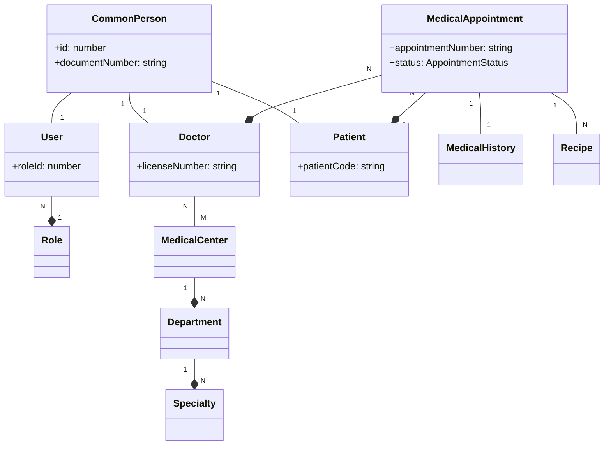

# 🛠️ API Gestión Médica — NestJS, PostgreSQL, Redis, JWT

API REST construida con **NestJS** + **TypeORM** + **PostgreSQL** para la gestión médica integral.

- Autenticación **JWT**
- **Sesiones en Redis** (single-session por usuario)
- **Rate limiting** con Throttler
- **Cache Redis** (manual por servicio)
- **Roles/Permisos** con guard global
- **Bull Board** (panel de colas) y **Logs UI**
- Configuración centralizada con `@nestjs/config` + **validación de .env**

---

## 🚀 Características

### 🛡️ Seguridad y Core

- 🔐 **JWT + JwtAuthGuard**: Autenticación segura.
- 🧠 **Sesión activa en Redis**: Verifica que el userId tenga sesión válida.
- 🚫 **Single-Session**: Al loguear, se cierra la sesión anterior del usuario.
- 🧩 **PermissionsGuard**: Restricción de acceso por rol/permisos.
- ⚡ **Throttler**: Rate limiting global y por ruta para prevenir abusos.
- 📦 **Cache Redis**: Optimización de lectura manual en servicios críticos.

### 🏥 Gestión Médica

- 👤 **Usuarios, Roles y Permisos**: Gestión completa de acceso.
- 👥 **CommonPerson**: Entidad base para Doctores, Pacientes y Usuarios, centralizando datos personales.
- 🏥 **Centros Médicos y Médicos**: Gestión de infraestructura y personal de salud.
- 📋 **Pacientes**: Registro detallado de pacientes vinculado a `CommonPerson`.
- 🏢 **Departamentos**: Organización interna de los centros médicos.
- 📅 **Citas Médicas**: Hub central con auto-creación de paciente, control de disponibilidad y agenda.
- 📜 **Historial Médico**: Registro de evoluciones vinculado a citas.
- 💊 **Recetas (Recipes)**: Emisión de recetas médicas vinculadas a citas.
- ⚙️ **Parámetros**: Catálogos configurables (especialidades, tipos de sangre, etc.).

### 🛠️ Herramientas de Administrador

- 📊 **Bull Board**: Panel de gestión de colas en `/admin/queues`.
- 🩺 **Health Check**: Endpoint `/health` para monitoreo.
- 🧠 **Logs UI**: Visualización de logs en tiempo real vía web.

---

## 📊 Arquitectura Visual



---

## 📁 Estructura del proyecto

```
src/
├─ auth/                # Autenticación, Guards, Estrategias JWT
├─ common-person/       # Entidad base de personas (reutilizable)
├─ user/                # Gestión de usuarios del sistema
├─ role/                # Roles de usuario
├─ permission/          # Permisos granulares
├─ medical-center/      # Gestión de clínicas/hospitales
├─ doctors/             # Registro de médicos y especialistas
├─ patient/             # Gestión de pacientes
├─ departments/         # Departamentos de centros médicos
├─ medical-appointments/# Hub de citas médicas
├─ medical-history/     # Evoluciones e historias clínicas
├─ recipe/              # Gestión de recetas médicas
├─ parameters/          # Catálogos y parámetros del sistema
├─ menu/                # Configuración dinámica del menú/sidebar
├─ files/               # Gestión de carga de archivos (S3/Local)
├─ crypto/              # Utilidades de cifrado
├─ redis-session/       # Lógica de sesiones en Redis
├─ common/              # Interceptores, Filtros, Excepciones globales
├─ configuration/       # Carga y validación de variables de entorno
├─ database/            # Conexión y migraciones
├─ logs/                # Backend de logs y UI de visualización
├─ queues/              # Configuración de Bull y Bull Board
├─ health/              # Health checks
├─ email/               # Servicio de envío de correos
└─ main.ts              # Punto de entrada
```

---

## 🧩 Configuración (.env)

```env
# App
APP_NAME=API Gestión Médica
PORT=7008
NODE_ENV=development
URL_HOST=localhost
CORS_ORIGIN=http://localhost:3000

# Base de Datos (PostgreSQL)
DB_HOST=localhost
DB_PORT=5432
DB_USER=postgres
DB_PASS=123456
DB_NAME=bd_gestion_medica

# Redis (Cache, Sessions, Queues)
REDIS_HOST=localhost
REDIS_PORT=6379
REDIS_SESSION_HOST=localhost
REDIS_SESSION_PORT=6379
CACHE_TTL=3600
CACHE_MAX=1000

# Security
JWT_SECRET=tu_secreto_super_seguro
JWT_EXPIRES_IN=1h

# Bull Board Admin
USER_BULL=admin
PASSWORD_BULL=123456
JWT_SECRET_BULL=bull_secret
BULL_BOARD_PORT=9999

# Mail (Mailpit/SMTP)
EMAIL_HOST=localhost
EMAIL_PORT=1025
EMAIL_SECURE=false
EMAIL_USER=
EMAIL_PASS=

# Otros
TZ=America/Caracas
```

---

## 🧪 Endpoints Principales

### 🔐 Autenticación y Sesión

- `POST /auth/login`: Login centralizado.
- `POST /auth/logout`: Cierre de sesión y limpieza de Redis.
- `GET /auth/session`: Verifica estado de la sesión actual.

### 📅 Citas Médicas

- `POST /medical-appointments`: Agendar cita (crea paciente si no existe).
- `GET /medical-appointments/availability`: Consultar slots libres de un médico.
- `PATCH /medical-appointments/:id/cancel`: Cancelar cita.
- `PATCH /medical-appointments/:id/complete`: Marcar como atendida.

### 👤 Usuarios y Personas

- `GET /users`: Listado de usuarios del sistema.
- `GET /common-person`: Búsqueda de personas por documento.

### 🏢 Infraestructura

- `GET /medical-center`: Listado de centros médicos.
- `GET /departments`: Departamentos por centro médico.

---

## 🧠 Notas Técnicas

### El Patrón `CommonPerson`

Para evitar la duplicidad de datos (nombre, cédula, teléfono), los `User`, `Doctor` y `Patient` apuntan a un registro en `CommonPerson`. Si una persona ya existe en el sistema por su número de documento, se reutiliza su perfil para crear nuevos roles.

### Caché y Rendimiento

Se implementó un sistema de caché manual sobre Redis para endpoints de alta frecuencia (Roles, Permisos, Parámetros).

- **Lectura:** Primero consulta Redis; si no existe, va a DB y guarda en Redis.
- **Escritura (CUD):** Se invalida la caché del recurso afectado para garantizar consistencia.

---

## ▶️ Arranque

```bash
# 1) Instalar dependencias
npm install

# 2) Configurar entorno
cp .env.example .env

# 3) Iniciar en desarrollo
npm run dev
```

**Swagger UI:** `http://localhost:7008/api`  
**Bull Board:** `http://localhost:9999/admin/queues`
