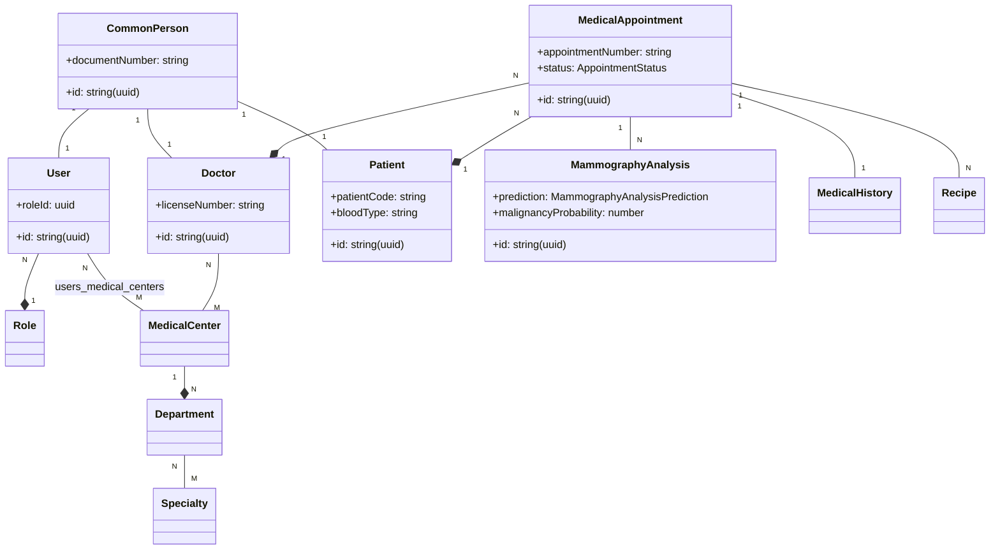

# 🛠️ API Gestión Médica — NestJS, PostgreSQL, Redis, JWT

API REST construida con **NestJS** + **TypeORM** + **PostgreSQL** para la gestión médica integral.

- Autenticación **JWT** (`@nestjs/jwt`, sin Passport)
- **Sesiones en Redis** (single-session por usuario)
- **Rate limiting** con Throttler
- **Caché Redis** (`cache-manager` 7 + Keyv, TTL en milisegundos)
- **Roles/Permisos** con guard global
- **Análisis de mamografías** delegado al servicio detector (ML)
- **Bull Board** (panel de colas) y **Logs UI**
- Configuración centralizada con `@nestjs/config` + **validación de .env** (Joi)
- Esquema de base de datos gestionado por **migraciones TypeORM**

La documentación técnica completa está en [`ARCHITECTURE_BACKEND.md`](./ARCHITECTURE_BACKEND.md).

---

## 🚀 Características

### 🛡️ Seguridad y Core

- 🔐 **JwtAuthGuard**: valida el token (header `Authorization: Bearer` o cookie `access_token`). El payload solo lleva `{ id, roleId, name }`.
- 🧠 **SessionGuard**: exige que el token coincida con la sesión activa en Redis y que el usuario y su rol sigan activos.
- 🚫 **Single-Session**: al iniciar sesión se reemplaza la sesión anterior del usuario.
- 🧩 **PermissionsGuard**: restricción por permisos `modulo.accion` del rol (`@Permission()`).
- ⚡ **Throttler**: rate limiting global y por ruta.
- 📦 **Caché Redis**: listados y detalles con invalidación por registro de claves; permisos del rol cacheados 1 h.

### 🏥 Gestión Médica

- 👤 **Usuarios, Roles y Permisos**: gestión completa de acceso. El personal no médico se vincula a centros médicos (`users_medical_centers`).
- 👥 **CommonPerson**: entidad base para Doctores, Pacientes y Usuarios, centralizando datos personales.
- 🏥 **Centros Médicos y Médicos**: gestión de infraestructura y personal de salud.
- 📋 **Pacientes**: registro detallado de pacientes vinculado a `CommonPerson` (código `PAC-<YYYY>-<NNNNN>`).
- 🏢 **Departamentos**: organización interna de los centros médicos.
- 📅 **Citas Médicas**: hub central con auto-creación de paciente, control de disponibilidad y agenda.
- 📜 **Historial Médico**: registro de evoluciones vinculado a citas.
- 💊 **Recetas (Recipes)**: emisión de recetas médicas vinculadas a citas.
- 🧠 **Análisis de mamografías**: el backend envía la imagen al detector y guarda la predicción.
- ⚙️ **Parámetros**: catálogos configurables (especialidades, alergias, enfermedades crónicas, medicamentos, género, estado civil, documentos de identidad, estados, municipios, parroquias). El tipo de sangre del paciente es un campo de texto, no un catálogo.

### 🛠️ Herramientas de Administrador

- 📊 **Bull Board**: panel de colas en `/admin/queues` (mismo puerto de la API), protegido por JWT + sesión + permiso `bullboard.consultar`. Login en `/admin/login`.
- 🩺 **Health Check**: endpoint público `/health` (sin token) para monitoreo.
- 🧠 **Logs UI**: visualización de logs vía web en `/logs/ui/view` (permiso `logs.consultar`).

---

## 📊 Arquitectura Visual


```mermaid
classDiagram
    class CommonPerson {
        +id: string (uuid)
        +documentNumber: string
    }
    class User {
        +id: string (uuid)
        +roleId: uuid
    }
    class Doctor {
        +id: string (uuid)
        +licenseNumber: string
    }
    class Patient {
        +id: string (uuid)
        +patientCode: string
        +bloodType: string
    }
    class MedicalAppointment {
        +id: string (uuid)
        +appointmentNumber: string
        +status: AppointmentStatus
    }
    class MammographyAnalysis {
        +id: string (uuid)
        +prediction: MammographyAnalysisPrediction
        +malignancyProbability: number
    }

    CommonPerson "1" -- "1" User
    CommonPerson "1" -- "1" Doctor
    CommonPerson "1" -- "1" Patient
    User "N" --* "1" Role
    User "N" -- "M" MedicalCenter : users_medical_centers
    MedicalCenter "1" --* "N" Department
    Department "N" -- "M" Specialty
    Doctor "N" -- "M" MedicalCenter
    MedicalAppointment "N" --* "1" Patient
    MedicalAppointment "N" --* "1" Doctor
    MedicalAppointment "1" -- "1" MedicalHistory
    MedicalAppointment "1" -- "N" Recipe
    MedicalAppointment "1" -- "N" MammographyAnalysis
```

---

## 📁 Estructura del proyecto

```
src/
├─ auth/                 # Autenticación, guards, PanelAccessService, ofuscación de permisos
├─ common-person/        # Entidad base de personas (reutilizable)
├─ user/                 # Usuarios del sistema y su vínculo con centros médicos
├─ role/                 # Roles de usuario
├─ permission/           # Permisos granulares
├─ medical-center/       # Gestión de clínicas/hospitales
├─ doctors/              # Registro de médicos y horarios
├─ patient/              # Gestión de pacientes
├─ departments/          # Departamentos de centros médicos
├─ medical-appointments/ # Hub de citas médicas
├─ medical-history/      # Evoluciones e historias clínicas
├─ recipe/               # Gestión de recetas médicas
├─ mammography-analysis/ # Análisis ML de mamografías + cliente del detector
├─ parameters/           # Catálogos y parámetros del sistema
├─ menu/                 # Configuración dinámica del menú/sidebar
├─ files/                # Carga de archivos en disco local (multipart, DICOM)
├─ crypto/               # Utilidades de cifrado
├─ redis-session/        # Lógica de sesiones en Redis
├─ common/               # Interceptores, filtros, caché, secuencias, servicios de acceso
├─ configuration/        # Carga y validación de variables de entorno
├─ database/             # Conexión, DataSource del CLI y migraciones
├─ logs/                 # Backend de logs y UI de visualización
├─ queues/               # BullMQ y Bull Board
├─ health/               # Health checks
├─ dashboard/            # Estadísticas
└─ main.ts               # Punto de entrada
```

---

## 🧩 Configuración (.env)

La lista autoritativa es `src/configuration/validation.ts`: si falta una variable obligatoria, la app no arranca. Los valores siguientes son **marcadores**; nunca se versionan secretos reales.

```env
# App
NODE_ENV=development            # development | production | test (Swagger solo en development)
PORT=7008                       # Joi usa 7008 si falta; en Docker es 8008
URL_HOST=localhost
TZ=America/Caracas
CORS_ORIGIN=http://localhost:4200   # opcional; sin valor se acepta cualquier origen

# Base de Datos (PostgreSQL)
DB_HOST=localhost               # obligatoria
DB_PORT=5432
DB_USER=<usuario>
DB_PASS=<clave>                 # obligatoria (puede ser vacía)
DB_NAME=bd_gestion_medica

# Redis (caché y colas)
REDIS_HOST=localhost            # obligatoria
REDIS_PORT=6379
REDIS_PASSWORD=<clave-redis>    # también la usan las sesiones si REDIS_SESSION_PASS está vacía

# Redis (sesiones)
REDIS_SESSION_HOST=localhost    # obligatoria
REDIS_SESSION_PORT=6379
REDIS_SESSION_PASS=

# JWT
JWT_SECRET=<secreto-access>             # obligatoria
JWT_EXPIRES_IN=1h
JWT_REFRESH_SECRET=<secreto-refresh>    # obligatoria
JWT_REFRESH_EXPIRES_IN=7d               # opcional (leída por el código); fija también el TTL de la sesión

# Cifrado
ENCRYPT_KEY=<minimo-16-caracteres>      # obligatoria
PERMISSIONS_SECRET=<clave-compartida-con-el-frontend>   # opcional; ofuscación de /auth/me

# Caché
CACHE_TTL_MS=300000             # TTL por defecto en milisegundos

# Detector de cáncer de mama (servicio ML)
DETECTOR_URL=http://localhost:8501      # obligatoria; el backend llama a ${DETECTOR_URL}/predict
DETECTOR_SECRET=<secreto-compartido>    # obligatoria; cabecera X-Detector-Secret
DETECTOR_TIMEOUT_MS=30000

# Archivos (opcionales)
UPLOADS_PATH=uploads
MAX_VIDEO_MB=20
```

Variables que ya **no** existen: `CACHE_TTL`, `CACHE_MAX`, `TOKEN_VALIDATOR`, `EMAIL_*`, `BULL_BOARD_PORT`, `USER_BULL`, `PASSWORD_BULL`, `JWT_SECRET_BULL`. Bull Board se sirve en el puerto de la API (`/admin/queues`).

---

## 🗄️ Migraciones

El esquema de tablas lo gestionan las migraciones de `src/database/migrations/`; la app no usa `synchronize` y `SchemaInitService` solo crea los esquemas PostgreSQL que falten.

```bash
npm run migration:show                                          # estado de cada migración
npm run migration:run                                           # aplica las pendientes
npm run migration:revert                                        # revierte la última (su down)
npm run migration:generate -- src/database/migrations/<Nombre>  # genera desde cambios en entidades
```

Después de generar y aplicar, comprobar que no queda deriva entre entidades y BD:

```bash
npm run typeorm -- migration:generate src/database/migrations/DriftCheck --dryrun --check
# Debe responder: No changes in database schema were found
```

Toda migración tiene `down`. Revisar siempre el SQL generado antes de aplicarlo. En el contenedor, `npm run migration:run:prod` se ejecuta antes de `node dist/main.js`; si falla, el backend no arranca.

---

## 🧪 Endpoints Principales

Sin prefijo global: las rutas cuelgan de la raíz. Salvo las marcadas como públicas, todas exigen JWT + sesión activa.

### 🔐 Autenticación y Sesión

- `POST /auth/login` (pública): login; responde `{ access_token, refresh_token }`. Usuario inexistente, inactivo o clave errónea → 401 "Credenciales inválidas".
- `POST /auth/refresh` (pública): renueva ambos tokens si el refresh coincide con el de la sesión.
- `POST /auth/logout`: cierre de sesión y limpieza de Redis.
- `GET /auth/session`: verifica el estado de la sesión actual.
- `GET /auth/me`: datos del usuario, `doctorId` y `modules` (permisos, menús y centros médicos, ofuscados).

### 📅 Citas Médicas

- `POST /medical-appointments`: agendar cita (crea paciente si no existe).
- `GET /medical-appointments/availability`: consultar slots ocupados de un médico.
- `PATCH /medical-appointments/:id/cancel`: cancelar cita.
- `PATCH /medical-appointments/:id/complete`: marcar como atendida.
- `PATCH /medical-appointments/:id/finish-consultation`: crea historial + receta y completa la cita en una transacción.

### 🧠 Mamografías

- `POST /mammography-analyses`: analiza un archivo de cita (`appointmentFileId`) con el detector y guarda el resultado.
- `POST /mammography-analyses/preview`: analiza una imagen subida sin guardar.
- `GET /mammography-analyses/inbox`, `/recent`, `/stats/daily`: bandeja, ranking y estadísticas del día.

### 👤 Usuarios y Personas

- `GET /users`: listado de usuarios del sistema.
- `GET /common-persons`: listado y búsqueda de personas (`search`).

### 🏢 Infraestructura

- `GET /medical-centers`: listado de centros médicos (con conteo de médicos y departamentos no borrados).
- `GET /departments`: departamentos (filtro opcional `medicalCenterId`).

### 🩺 Operación

- `GET /health` (pública): ping a la BD y memoria.

---

## 🧠 Notas Técnicas

### El Patrón `CommonPerson`

Para evitar la duplicidad de datos (nombre, cédula, teléfono), los `User`, `Doctor` y `Patient` apuntan a un registro en `CommonPerson`. Si una persona ya existe en el sistema por su número de documento, se reutiliza su perfil para crear nuevos roles.

### Caché y Rendimiento

Caché sobre Redis con `@nestjs/cache-manager` 3 + `cache-manager` 7 (store Keyv `@keyv/redis`, sin prefijo de clave, con `REDIS_PASSWORD`). **Todos los TTL están en milisegundos.**

- **Lectura:** primero consulta Redis; si no existe, va a la BD y guarda con `CACHE_TTL.LIST` (5 min) o `CACHE_TTL.DETAIL` (10 min) dentro del alcance de la entidad (clave `<clave>#<generación>`).
- **Escritura (CUD):** invalida el alcance con una sola escritura (generación nueva). Las vistas de citas están en el alcance `appointment`, que también invalidan pacientes, médicos, historiales, recetas y los catálogos que embeben (alergias, medicamentos, especialidades, centros, departamentos...).
- **Permisos:** la lista de permisos de cada rol se cachea 1 h con claves por generación (`permission:g<gen>:<scope>`); cambiar los grants de un rol invalida su scope y cambiar una acción o un menú invalida todo.

### Códigos legibles

`APT-`, `CONS-`, `REC-` y `PAC-` salen de secuencias PostgreSQL (`seq_appointment_number`, `seq_consultation_number`, `seq_recipe_number`, `seq_patient_code`). Formato `<PREFIJO>-<YYYY>-<NNNNN>`; el contador no se reinicia cada año.

---

## ▶️ Arranque

### Local

```bash
# 1) Instalar dependencias
npm install

# 2) Configurar entorno (completar los marcadores; ver sección Configuración)
cp .env.example .env

# 3) Aplicar migraciones
npm run migration:run

# 4) Iniciar en desarrollo
npm run dev
```

Con `NODE_ENV=development` y `PORT=7008`:

- **Swagger UI:** `http://localhost:7008/api` (solo en `development`)
- **Bull Board:** `http://localhost:7008/admin/queues` (login en `/admin/login`)
- **Logs UI:** `http://localhost:7008/logs/ui/view`

### Docker

Este repositorio ya no tiene `docker-compose.yml`. El compose real es `tesis/docker-compose.yml`, en la carpeta padre, y levanta:

| Servicio | Contenedor | Puerto en el host |
|----------|------------|-------------------|
| `backend` | `medos-backend` | 8008 |
| `frontend` | `medos-frontend` | 8007 |
| `machine-learning` | `medos-ml-api` | sin puerto publicado (solo red interna) |
| `redis-shared` | `medos-redis` | 8010 |

Requisitos: `api-gestion-medica/.env` (lo carga el servicio `backend`) y `tesis/.env` (no versionado) con `REDIS_PASSWORD` y `DETECTOR_SECRET`; el compose no arranca sin ellas. PostgreSQL corre en el host (`DB_HOST=host.docker.internal`).

```bash
# Desde api-gestion-medica/
docker compose -f ../docker-compose.yml up -d --build backend redis-shared
```

El contenedor aplica las migraciones pendientes al arrancar y corre con `NODE_ENV=production` y `PORT=8008`: la API queda en `http://localhost:8008` y **Swagger no existe** (`/api` → 404). Para el análisis de mamografías, levantar también `machine-learning`.
